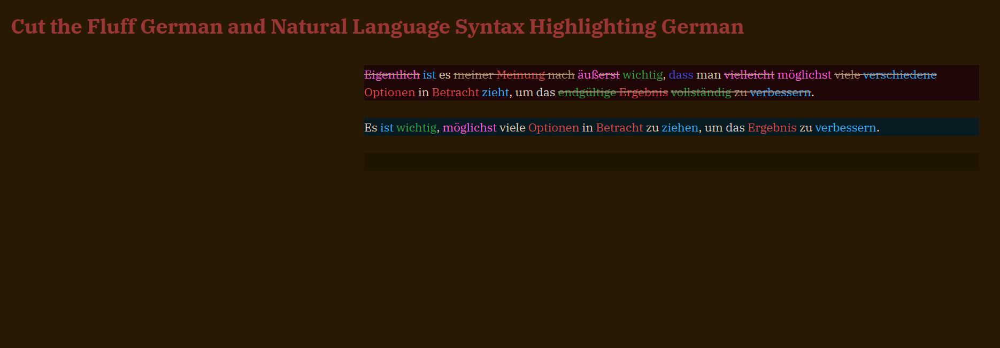
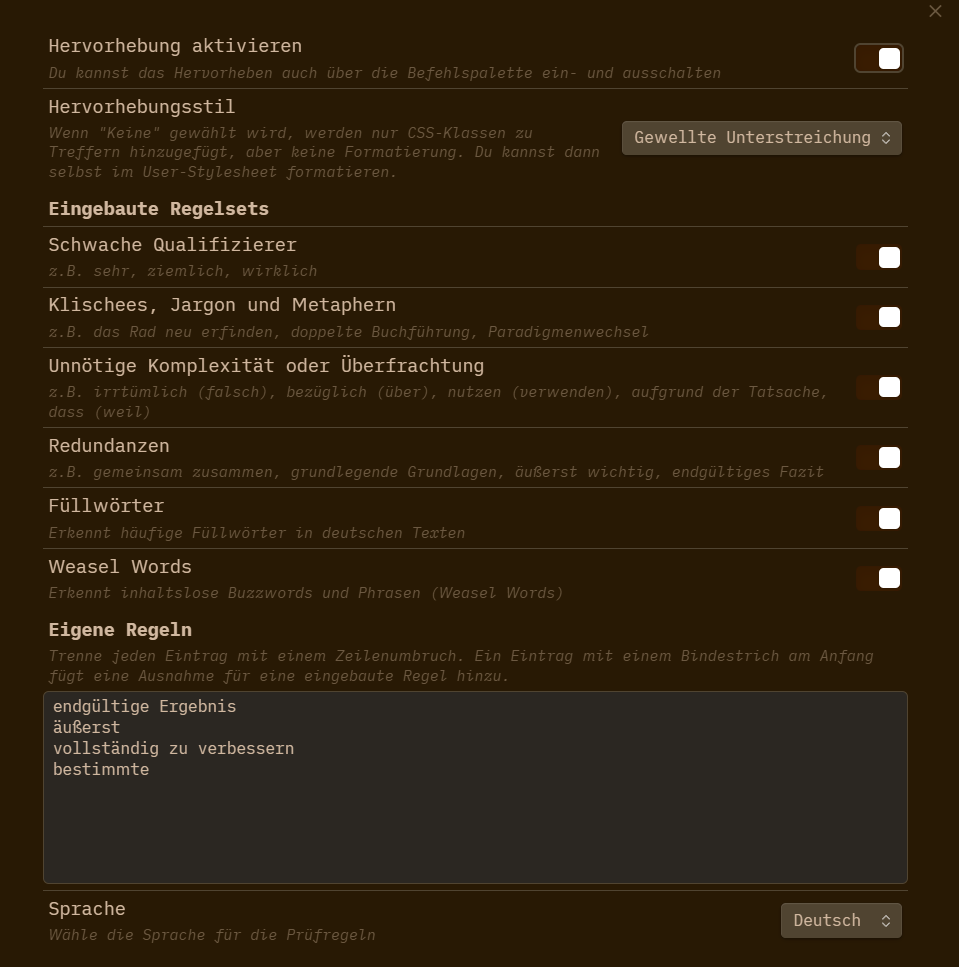

# Cut the Fluff German (for Obsidian)

Gute Texte sind klar und präzise. Cut the Fluff German hilft dir, deinen Stil zu verbessern, indem es unnötige Füllwörter, Weasel Words, Redundanzen und Komplexität erkennt.

Beispiele:

* **Füllwörter** (z.B. ~~aber~~, ~~eigentlich~~, ~~halt~~, ~~ziemlich~~, ~~vielleicht~~)
* **Weasel Words** (z.B. ~~äußerst~~, ~~diverse~~, ~~enorm~~, ~~signifikant~~, ~~überraschend~~)
* **Redundanzen** (z.B. ~~tatsächliche~~ Tatsachen, ~~vollständig~~ vernichten, ~~endgültiges~~ Ende, ~~absolut~~ notwendig)
* **Unnötige Komplexität** (z.B. ~~aufgrund der Tatsache~~, ~~meiner Meinung nach~~, ~~in Anbetracht der Tatsache~~)

## Hinweis für Entwickler / Developer Notice

**Deutsch:**  
Um eigene Wörter hinzuzufügen oder bestehende zu entfernen, klone dieses Repository und passe die Datei `rulesets.de.ts` nach deinen Wünschen an.  
Führe anschließend `npm install` und dann `npm run build` aus.  
Ersetze die `main.js`-Datei im Plugin-Ordner deiner Obsidian-Installation.

**English:**  
To add your own words or remove existing ones, clone this repository and edit the `rulesets.de.ts` file as you like.  
Then run `npm install` and `npm run build`.  
Replace the `main.js` file in your Obsidian plugin folder with this new one.

## Installation

1. Download the latest release assets from the [Releases page](https://github.com/n12k0/obsidian-cut-the-fluff-german/releases).
2. Unzip the downloaded folder.
3. Move the unzipped folder into your vault's `.obsidian/plugins` directory.
4. Restart Obsidian or enable the plugin from the Obsidian settings under "Community plugins".

## Datenschutz

Alle Verarbeitung erfolgt lokal auf deinem Gerät. Deine Texte oder andere Daten werden niemals an einen Server gesendet.

## Regeln

Es gibt eingebaute Regeln für Füllwörter, Weasel Words, Weak Qualifiers, Redundanzen, Jargon und Komplexität. Du kannst eigene Wörter und Ausnahmen hinzufügen.

### Anzeige

* Abblenden
* Durchstreichen
* Unterstreichen
* Keine (nur CSS-Klasse für eigene Formatierung)

Thanks to [Adam Fletcher](https://github.com/adamfletcher/obsidian-cut-the-fluff) for the inspiration and the code. This is simply a fork of the original plugin adapted for German.
Thanks to [TimKam](https://github.com/TimKam) for the word lists.

If you want to fully emulate the iA Writer experience while writing in German in Obsidian, check out my other fork: [nl-syntax-highlighting-german](https://github.com/n12k0/nl-syntax-highlighting-german). This plugin highlights German adjectives, nouns, adverbs, verbs, articles, and conjunctions in the editor.
