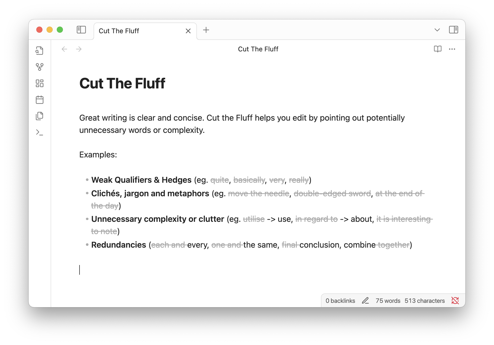

# Cut The Fluff (for Obsidian)

Great writing is clear and concise. Cut the Fluff helps you edit by pointing out potentially unnecessary words or complexity. 

Examples:

* **Weak Qualifiers & Hedges** (eg. ~~quite~~, ~~basically~~, ~~very~~, ~~really~~)
* **Clichés, jargon and metaphors** (eg. ~~move the needle~~, ~~double-edged sword~~, ~~at the end of the day~~)
* **Unnecessary complexity or clutter** (eg. ~~utilise~~ -> use, ~~in regard to~~ -> about, ~~it is interesting to note~~)
* **Redundancies** (~~each and~~ every, ~~one and~~ the same, ~~final~~ conclusion, combine ~~together~~)

# Customization

## Rules

There are 4 built-in rulesets matching the categories from the examples above which can each be enabled and disabled. You can add custom words and phrases, or add an exception for any of the built-in matches. 

## Display

* Dim
* Strikethrough
* Underline
* None

If you select 'None' the plugin will apply a `fluff` class to any matches allowing you to apply custom formatting in your user stylesheet. 